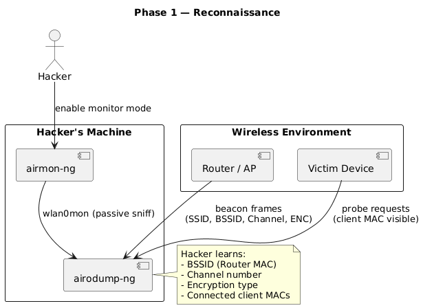
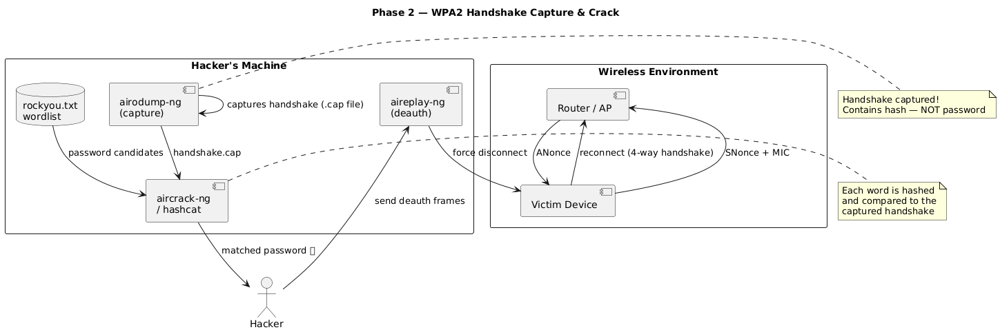
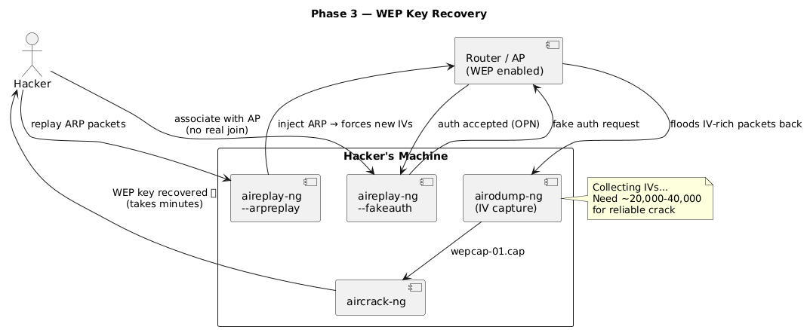
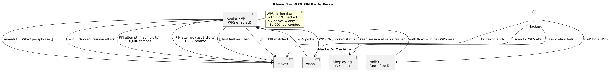
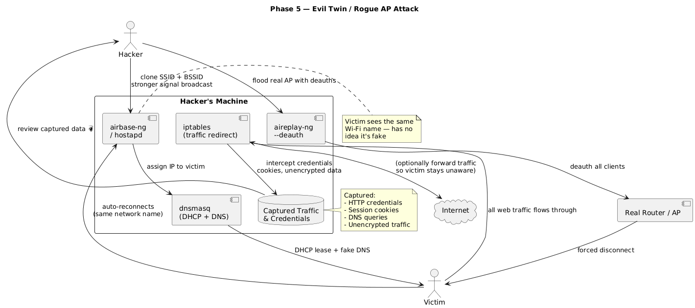
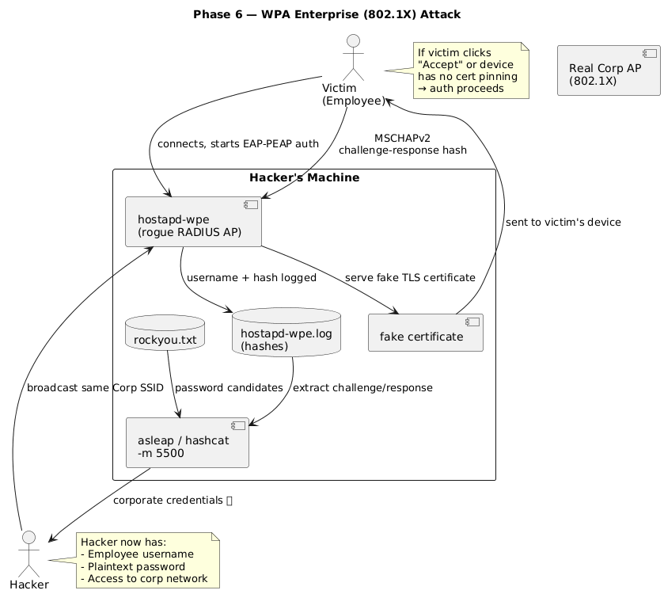

# Wi-Fi Attack Flow Diagrams

> ⚠️ **For educational and authorized security research purposes only.**  
> All techniques shown are intended to help security professionals understand attack vectors and build better defenses.

---

## Overview

This document visualizes how common Wi-Fi attacks occur between real-world entities — hackers, victims, routers, and tools — across 6 phases.

| Phase | Attack | Key Tools |
|-------|--------|-----------|
| 1 | Reconnaissance | airmon-ng, airodump-ng |
| 2 | WPA2 Handshake Capture | aireplay-ng, aircrack-ng, hashcat |
| 3 | WEP Key Recovery | aireplay-ng, aircrack-ng |
| 4 | WPS PIN Brute Force | reaver, wash, mdk3 |
| 5 | Evil Twin / Rogue AP | airbase-ng, dnsmasq, iptables |
| 6 | WPA Enterprise (802.1X) | hostapd-wpe, asleap, hashcat |

---

## Phase 1 — Reconnaissance

> The hacker passively listens to the wireless environment to identify targets before any active attack begins.

---

## Phase 2 — WPA2 Handshake Capture & Crack

> The hacker forces a victim off the network, captures the reconnection handshake, then cracks it offline using a wordlist.

---

## Phase 3 — WEP Key Recovery

> WEP's flawed IV mechanism is exploited by injecting traffic to generate enough IVs for statistical key recovery.

---

## Phase 4 — WPS PIN Brute Force

> WPS's split-PIN validation flaw reduces 100 million combinations to just ~11,000 — making brute force practical in hours.

---

## Phase 5 — Evil Twin / Rogue AP

> A fake access point clones a legitimate network. Victims auto-connect, routing all their traffic through the hacker's machine.

---

## Phase 6 — WPA Enterprise (802.1X) Attack

> A rogue RADIUS server impersonates the corporate AP, capturing MSCHAPv2 credential hashes from unsuspecting employees.

---

## Defenses at a Glance

| Threat | Defense |
|--------|---------|
| WPA2 Handshake Crack | Use WPA3 or strong 20+ char passphrase |
| WEP Key Recovery | Disable WEP entirely |
| WPS Brute Force | Disable WPS in router settings |
| Evil Twin | Use VPN, deploy WIDS |
| WPA Enterprise Attack | EAP-TLS with certificate pinning |
| General | Segment networks, monitor for deauth floods |

---

*Diagrams generated using PlantUML. Source `.puml` files available in this repository.*
